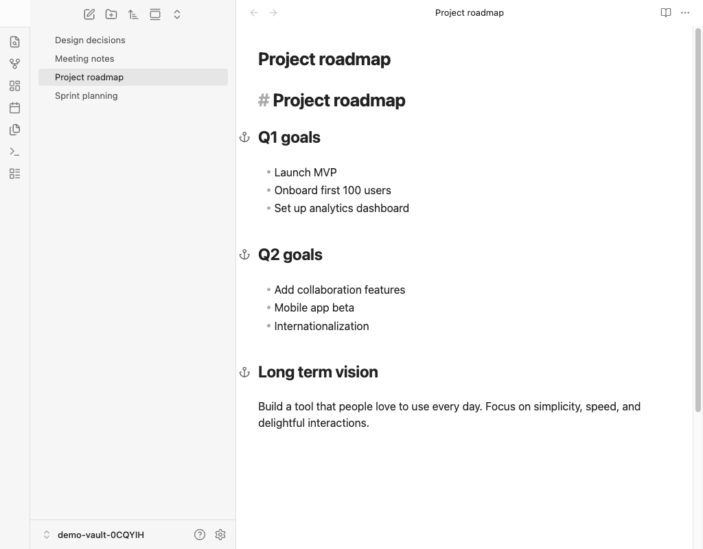
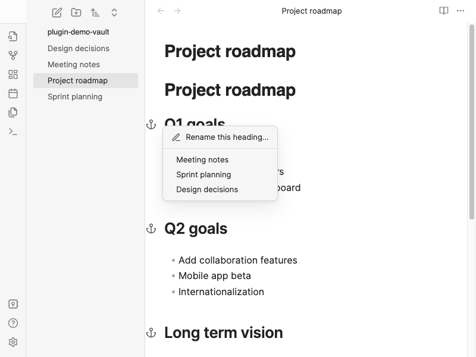

# Handle Header Link

_Читайте на русском: [README.ru.md](README.ru.md)._

An Obsidian plugin that shows an **anchor icon** in the editor gutter next to headings that are targeted by internal links (`[[Note#Heading]]` or `[[#Heading]]`). Click the icon to open a menu of all notes that link to that heading, then jump straight to the exact link line in the source file.

## Features

- **Vault-wide header backlinks**: Scans markdown files for wiki-style links and embeds that include a `#` fragment pointing at a heading. Builds a map of “which headings are linked from where.”
- **Gutter anchor icons**: In **Live Preview** and **Source** mode, referenced headings get a small anchor in the left gutter (next to the line number column). Headings with no incoming header links show no icon.
- **Quick navigation**: Click an anchor to open a context menu listing every source note. Choosing an entry jumps to the exact link line, and notes with multiple matches open a second chooser with `line: quote` entries.
- **Same-file links**: Supports `[[#Heading]]` / `[[#Some heading]]` style links where the target is a heading in the **same** note.
- **Embeds included**: References from `![[Note#Heading]]` style embeds are counted the same as ordinary `[[...]]` links.
- **Stays up to date**: When metadata changes (edits, new files, resolved links), the backlink map is rebuilt on a short debounce so the gutter stays in sync with the vault.

## Usage

1. In any note, create links to a heading in another file, for example `[[My note#Introduction]]`, or in the same file: `[[#Introduction]]`.
2. Open the **target** note (the one that **contains** the heading).
3. In the editor, find the heading line: an **anchor** appears in the gutter if at least one link points to that heading.
4. **Click** the anchor to see all notes that link to this heading; **click** a note name to jump to the link line, or choose a specific occurrence if the note links more than once.

**Tip**: The plugin matches headings by normalized text (trimmed, collapsed spaces, case-insensitive), consistent with how link fragments refer to heading titles.

## Demo

**Anchor icons in the gutter**  
Referenced headings show an anchor in the left gutter; headings without incoming header links have no icon.



**Context menu**  
Click an anchor to list every note that links to that heading, then jump to the exact link you need.



## Installation

### From Obsidian Community Plugins

1. Open **Settings → Community plugins**.
2. Turn off **Restricted mode** if needed, then open **Browse**.
3. Search for **Handle Header Link**.
4. Click **Install**, then **Enable**.

### Via BRAT

If the plugin is not yet in the community list or you prefer installing from GitHub:

1. Install the **BRAT** plugin from Community Plugins.
2. Open **Settings → BRAT → Add Beta plugin**.
3. Enter this repository URL: `https://github.com/rekby/obsidian-handle-header-link`
4. Add the plugin and enable **Handle Header Link** under Community plugins.

### Manual installation

1. Download `main.js`, `manifest.json`, and `styles.css` from the [latest release](https://github.com/rekby/obsidian-handle-header-link/releases).
2. Create the folder `<Vault>/.obsidian/plugins/handle-header-link/`.
3. Copy the three files into that folder.
4. Reload Obsidian and enable **Handle Header Link** in **Settings → Community plugins**.

## Development

```bash
npm install
npm run dev          # watch mode
npm run build        # typecheck + production bundle
npm run lint         # ESLint
```

### Demo assets

Regenerate **English and Russian** README screenshots and demo GIFs (requires a local Obsidian test setup configured for WebdriverIO and `ffmpeg` for GIF encoding):

```bash
npm run demo              # screenshots (docs/demo/ + docs/demo/ru/) + GIFs (docs/demo/*.gif + docs/demo/ru/*.gif)
npm run demo:screenshots  # README PNGs only (both languages, one run)
npm run demo:capture      # demo frame capture + manifests (EN + RU); then `npm run demo:render` for GIFs
npm run demo:screenshots:ru   # Russian README PNGs only (faster iteration)
```

## Known limitations

- Only **heading** links (`#fragment`) are considered, not block references (`^block-id`).
- Notes with several links to the same heading open a second chooser so you can pick the exact occurrence.

## License

See [LICENSE](LICENSE).
