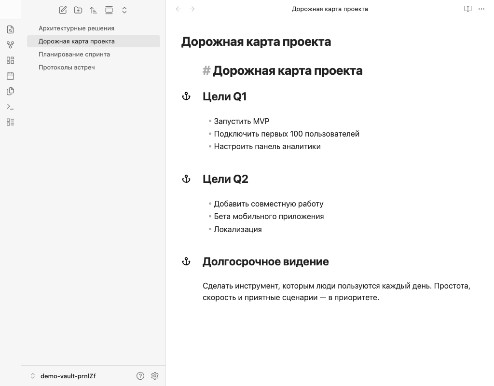
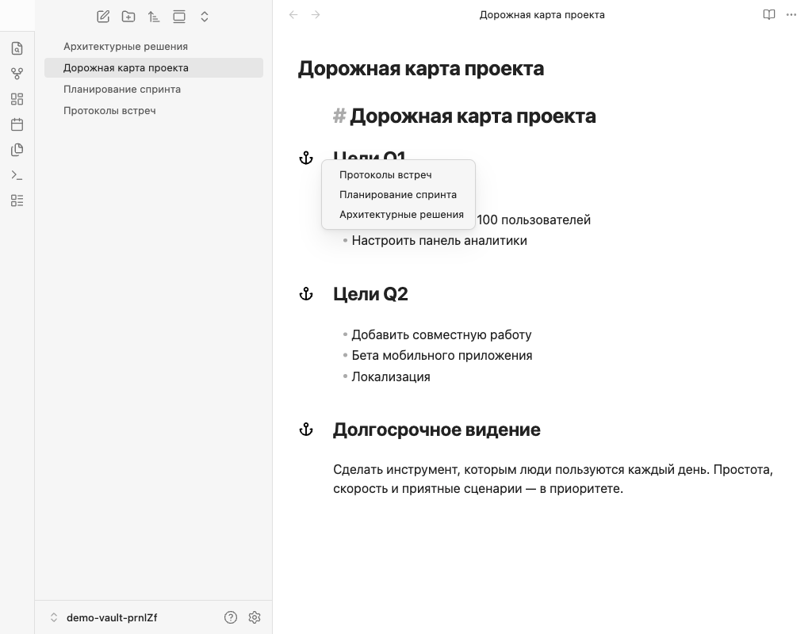

# Handle Header Link

_Read in English: [README.md](README.md)._

Плагин для Obsidian, который показывает **иконку якоря** в канале редактора (gutter) слева от заголовков, на которые ссылаются внутренние ссылки (`[[Заметка#Заголовок]]` или `[[#Заголовок]]`). Нажмите на иконку, чтобы открыть меню со всеми заметками, ссылающимися на этот заголовок, и перейдите к нужной — в исходный файл со ссылкой.

## Возможности

- **Обратные ссылки по заголовкам по всему хранилищу**: обход markdown-файлов в поиске wiki-ссылок и вставок с фрагментом `#`, указывающим на заголовок. Строится карта «какие заголовки куда ссылаются».
- **Иконки-якоря в канале**: в режимах **Live Preview** и **Исходный код** у заголовков, на которые есть ссылки, слева отображается небольшой якорь (рядом с номерами строк). У заголовков без входящих ссылок по заголовку иконки нет.
- **Быстрая навигация**: клик по якорю открывает контекстное менсо со списком исходных заметок (имена файлов). Выбор пункта открывает заметку в Obsidian.
- **Ссылки внутри одного файла**: поддерживаются ссылки вида `[[#Заголовок]]` / `[[#Какой-то заголовок]]`, когда цель — заголовок в **той же** заметке.
- **Учитываются вставки**: ссылки из вставок `![[Заметка#Заголовок]]` учитываются так же, как обычные `[[...]]`.
- **Актуальность**: при изменении метаданных (правки, новые файлы, разрешённые ссылки) карта обратных ссылок пересобирается с короткой задержкой, канал остаётся согласованным с хранилищем.

## Как пользоваться

1. В любой заметке создайте ссылки на заголовок в другом файле, например `[[Моя заметка#Введение]]`, или в том же файле: `[[#Введение]]`.
2. Откройте **целевую** заметку (ту, где **есть** этот заголовок).
3. В редакторе найдите строку заголовка: если на него ссылается хотя бы одна ссылка, в канале появится **якорь**.
4. **Нажмите** на якорь, чтобы увидеть все заметки со ссылкой на этот заголовок; **нажмите** имя заметки, чтобы открыть её.

**Подсказка**: плагин сопоставляет заголовки по нормализованному тексту (без лишних пробелов, без учёта регистра), в духе того, как фрагменты ссылок относятся к заголовкам.

## Демо

**Иконки-якоря в канале**  
У заголовков, на которые ссылаются, слева показывается якорь; у заголовков без входящих ссылок по заголовку иконки нет.



**Контекстное меню**  
Клик по якорю открывает список заметок со ссылками на этот заголовок; откройте нужную.



## Установка

### Из каталога Community Plugins в Obsidian

1. Откройте **Настройки → Сообщество плагинов**.
2. При необходимости отключите **Ограниченный режим**, затем откройте **Обзор**.
3. Найдите **Handle Header Link**.
4. Нажмите **Установить**, затем **Включить**.

### Через BRAT

Если плагина ещё нет в каталоге или вы предпочитаете установку с GitHub:

1. Установите плагин **BRAT** из Community Plugins.
2. Откройте **Настройки → BRAT → Add Beta plugin**.
3. Укажите URL репозитория: `https://github.com/rekby/obsidian-handle-header-link`
4. Добавьте плагин и включите **Handle Header Link** в разделе Community plugins.

### Ручная установка

1. Скачайте `main.js`, `manifest.json` и `styles.css` из [последнего релиза](https://github.com/rekby/obsidian-handle-header-link/releases).
2. Создайте папку `<Хранилище>/.obsidian/plugins/handle-header-link/`.
3. Скопируйте туда эти три файла.
4. Перезапустите Obsidian и включите **Handle Header Link** в **Настройки → Сообщество плагинов**.

## Разработка

```bash
npm install
npm run dev          # режим наблюдения
npm run build        # проверка типов + production-сборка
npm run lint         # ESLint
```

### Демо-материалы

Пересобрать **английские и русские** скриншоты для README и демо-GIF (нужны локальный Obsidian с WebdriverIO и **`ffmpeg`** для GIF):

```bash
npm run demo                 # скриншоты (docs/demo/ + docs/demo/ru/) + GIF (docs/demo/*.gif + docs/demo/ru/*.gif)
npm run demo:screenshots     # только PNG для README (оба языка за один запуск)
npm run demo:capture         # захват кадров демо (EN + RU); затем `npm run demo:render` для сборки GIF
npm run demo:screenshots:ru  # только русские PNG для README (быстрее при правках)
```

## Известные ограничения

- Учитываются только ссылки на **заголовки** (`#фрагмент`), не блочные ссылки (`^block-id`).
- В меню перечислены **исходные файлы**; при открытии файла действует стандартное поведение Obsidian (курсор не всегда прыгает точно на строку со ссылкой).

## Лицензия

См. [LICENSE](LICENSE).
